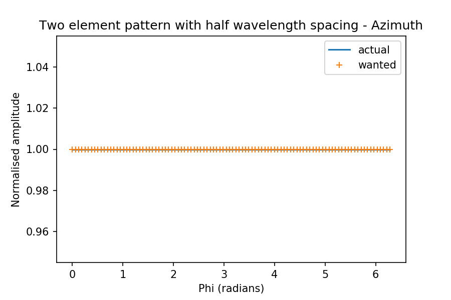

# pyoam
python orbital angular momentum codes

## Getting started

If you are already familiar with modelling antenna arrays, then you can jump straight into trying out the code. If not, here's a brief primer:

### Electromagnetic radiators

The electric field at a distance from a simple electromagnetic radiator is proportional to 1/r, where r is the distance. Note that the usual conservation of energy laws require this because the power (i.e. energy/time) in an electric field must be conserved as it radiates out into space in all directions. At each instant in time, the energy summed up over the surface of the sphere of radius r must be constant, thus the energy per unit area must reduce at the rate 1/r^2. Since power is proportional to energy , and since the power of an electric field is proportional to the amplitude squared  this forces the amplitude to reduce at a rate of 1/r, as explained [here](https://en.wikipedia.org/wiki/Near_and_far_field).

where:

- A is the complex amplitude of the field (i.e. includes the phase)
- U is the magnitude of the transmitter's radiation pattern as a function of elevation and azimuth
- r is distance between the transmitter and the receiver (or source and destination)
- t is the time
-  is the elevation
-  is the azimuth
- k is the propagation constant

For an isotropic radiator,  for all azimuth and elevation values.

For more complicated radiators, with multiple individual elements, the basic principle of the conservation of energy holds, but you are usually interested in the way the amount of energy radiated varies with the azimuth and elevation - this is sometimes called the radiation pattern or if it is an antenna array, sometimes it is also called the array factor.

[//]: <> (A\left(r,t,\theta,\phi\right)\propto\frac{U(\theta,\phi)}{4\pi}\frac{e^{kr + \omega t + \Psi(\theta,\phi)}}{r})

### Array factor (Array far field, or radiation pattern)

An array combines multiple radiators. For communications applications, radio waves are typically sufficiently low power that there are no non-linear effects occuring in the air between the transmit and receive antennas. So we can say that propagation takes place in a linear regime. That means we can use the principle of superposition to simply add up the fields arriving from different sources to find the far field at any given location far away from the antenna. If we have a list of sources, and a list of far field locations we want to know about the transmission from the array at, we have a simple task: do a complex (i.e. magnitude and phase) addition of the contribution from each source point at the first far field point on the list. Repeat for the next point on the far field list. We do this at a single frequency, i.e. we are calculating the channel properties. If we want to know about the effects on modulated signals, we can do this by repeating the calculation at different frequencies which represent the instantaneous frequencies used in the communication. Since we often have our signals limited to a specific licensed band, you will typically do the calculations for the centre frequency in the band, then the upper and lower band edges (maximum and minimum frequency). In some applications you may go further - but that is outside the scope of the present code. See background theory below for a couple of other considerations e.g. how to model the individual elements, and the effect of having multiple elements close together.

### Inputs

The code requires two arrays and a parameter:

- an array of source points 
- an array of destination points
- the frequency of the transmitted signals

Calculations are done on a single frequency. If you want to see the effect of varying the frequency, simply re-run the code with a different frequency setting. MKS units are assumed, so dimensions are in metres, and frequency in Hertz.

#### Geometry 

The calculation assumes a homogenous vaccuum with no objects - a good equivalent to modelling radio waves transmitted on a dry day, or in space. There is a bit of a difference on a rainy day at some frequencies such as millimetre-waves  - but that's probably outside the scope of your project. If you needed to model this, then you could consider extending the code to include an absorption term in the propagation. But don't do that unless you really know you need to. It's usually handled separately anyway.

The coordinate system is cartesian, i.e. defined in terms of positions on three orthogonal linear axes X, Y, Z. There is no pre-defined "UP" - that is over to you.

#### Source points

Source points have a position in 3D space, a phase and a magnitude. The frequency is the same for all source points, so we save some memory by storing the frequency as a single variable elsewhere, and not repeating it in every source point. The magnitude and phase of the source point are set by the modeller (you) - e.g. it might be eight elements spaced around the circumference of a circle, each with the phase increased by a quarter-pi compared to its neighbour in a clock-wise direction looking in the direction of transmission.

Source points are assumed to be iso-tropic. You might like to consider how to modify the code to permit the usage of calculated radiation patterns. I've previously done this for far field files calculated in CST, as seen in the legacy code [here](./legacy/n2ff.py), but you could do something that used simple analytical models of dipoles, for example. In which case, you need to describe the orientation of the radiation pattern with respect to the 3D environment you have created.

#### Far field sample points

The far field sample points also have a position in 3D space, and a phase and a magnitude. They have the same underlying data structure as a source point. We just treat them differently - we work out the phase and magnitude by summing the contributions from the source points.

#### Helpers

There are some helpers you might find useful to build for yourself (if they are not yet implemented) - if they are not already implemented, you will need to code them yourself.

Source helpers need to know something about the phase increment for the elements

- line array - number of elements, phase increment, total length, orientation, centre point
- circle array - number of elements, phase increment, diameter, orientation, centre-point

Far-field helpers only need the geometry info

- line field - number of elements, total length, orientation, centre-point
- circle field - number of elements, diameter, orientation, centre-point
- plane field - number of elements per side, side length, orientation, centre point

There are multiple ways to define each of these geometries - feel free to create your own methods to suit the way you want to work.

#### Validation

The approach taken in this code has been validated in other implementations, by comparison to measured data, and subsequently published in peer-reviewed journals. The code in this repo can be validated by comparing to the previously published data, starting with fairly simple linear arrays and building up to OAM-generating antennas.

The first validation example is taken from Kraus, J. D. and Marhefka R. J., "Antennas For All Applications", 3rd Edition (International), McGraw Hill, Boston, 2002, pp.90-93. A two-element array with isotropic elements spaced half a wavelength apart, and in-phase excitation gives a well-known pattern in the elevation plane:

And in the azimuth plane, a constant value:

## Background Theory

Orbital Angular Momentum (OAM) modes can be generated by antenna arrays. The code in this repo is intended to assist in modelling them.

### Orbital Angular Momentum Modes

For an introduction to OAM, see this [tutorial](https://doi.org/10.1049/iet-map.2017.0293).

### Antenna arrays

Traditional antenna arrays combine two or more antenna elements to provide features such as narrower beams, and beams which can be steered to different directions. These features are often attractive to designers of communication and radar systems because narrower, steerable beams avoid wasting energy on signal that the receiver will never intercept, thereby increasing the signal-to-noise ratio, and hence the maximum possible data rate. Of course, traditional beam steering is not all that antenna arrays can do - they can also do things like create spatial modes with interesting and useful properties, such as [OAM modes](https://doi.org/10.1049/iet-map.2017.0293).

#### Comments on modelling antennas and antenna arrays

There are some complicating factors we can neglect in a simple analysis of antenna arrays - the radiation pattern of the individual elements, and the parasitic effects of having more than one element in the array.

##### Array element patterns

Array antenna elements are often similar to antennas that are used on their own, and can be modelled in a similar way, i.e. using computationally intensive numerical software techniques so as to calculate the impact of details in the structure. There are a number of different techniques. One of the earlier methods that is useful for wire-based antennas is the Method of Moments, although I've tended to work on / use time domain methods such as [FDTD](https://doi.org/10.1002/mop.24310) and [FIT](https://doi.org/10.1049/iet-map.2015.0808). For our purposes, the differences in performance between different unit element types, and an isotropic radiator, is sufficiently small, that we can use isotropic radiators as our array elements. Just bear in mind that isotropic radiators are a theoretical oddity - they do not exist in the real world unless the emissions are [incoherent](https://en.wikipedia.org/wiki/Isotropic_radiator). 

You'll know when your analysis needs to upgrade to an actual real-world antenna pattern (you'll be trying to build something and figure out how well it should work, and the difference between what you are getting and what you expect should reduce if you start to use the correct radiation pattern for the unit elements). If you are not at that stage yet, or if you are otherwise in doubt as to whether you need to go that far, then you can stick with an isotropic radiator.

##### Parasitic loading effects

Antennas are sensitive to the presence of other antennas, and even just metal, especially within a range of a quarter of a wavelength. If the antennas in your array are spaced sufficiently far apart, then you can neglect the effects they have on each other in your analysis to make your calculations simpler and faster. That is the approach taken in this code - but be aware that there is no built-in facility to tell you when you really should start including the mutual effects. That's up to you! Like in the previous section - if you are simply exploring the effects of different array configurations, then ignoring mutual coupling is fine. When you start trying to compare simulation and measurement, you will find you want to include the effects to explain why the results are not as good as you expected.

### Legacy code
If you are new to OAM you can safely skip the legacy code. It deals with a particular implementation that complicates the analysis and takes more computer resource to run. The code in the legacy section of this repo combines elements of an approach used to calculate the properties of time-switched OAM antennas as reported in a 2017 EuCAP conference paper [https://doi.org/10.23919/EuCAP.2017.7928218] as applied to demonstrating the basic properties of different OAM modes, similar to those presented for a continuous wave system in Fig 4(a,b) of [2018 IET Tutorial article](https://doi.org/10.1049/iet-map.2017.0293). This code may come in handy if you want to develop any lines of investigation into time-switched antenna arrays, although bear in mind:

  - the time-switched array calculations require more CPU power
  - the modelling so far assumes there is no modulation i.e. no data
 
If you are not sure - skip the legacy code altogether.

### Extra thoughts

If you are conducting a great many runs of the code, with similar geometries, you might like to consider developing a caching mechanism your results for later re-use, and checking for runs which boil down to the same effective geometry if measured in terms of wavelengths (spoiler - don't actually do this - but do think about it). This is a considerable development task, and the effort invested would need to be traded off against the benefits gained. There is a cost to evaluating whether to use the cached result or calculate it fresh. For complex models, it is likely that there may be some efficiencies to be gained from having a cache granularity at the level of individual destination points and subsets of source points, however they are probably outweighed by the cost of whatever hashing scheme is used to index into the cache. So don't rush into trying this .... thinking about it is a useful exercise though, because it introduces you to the idea that it is the size of the geometry in terms of wavelengths which matters. Scale the geometry down by a factor of two, and double the frequency, you get the same results. It is only when you consider material properties, which vary with frequency, that you see differences for otherwise similar scale geometries. This leads to the realisation that different frequencies of electromagnetic waves do not have intrinsically different properties - it is the materials which they interact with that cause the frequency dependence (typically due to the nature of the atomic bonds in the molecules, and the frequencies at which they resonate). Thus you can rest easy that radio waves, light from the sun, and the x-rays used in medicine achieve their different purposes through the materials they interact with - not because they are any different from each other (except in wavelength, or energy - depending on the branch of physics or engineering you are working in at the time - see [Planck's constant](https://en.wikipedia.org/wiki/Planck_constant)).

